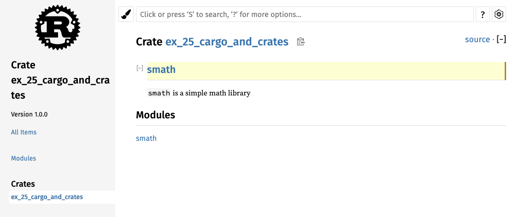
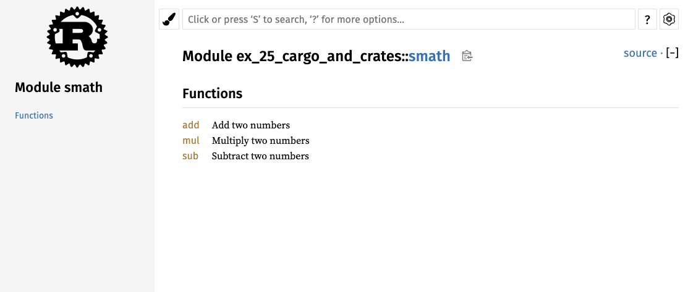
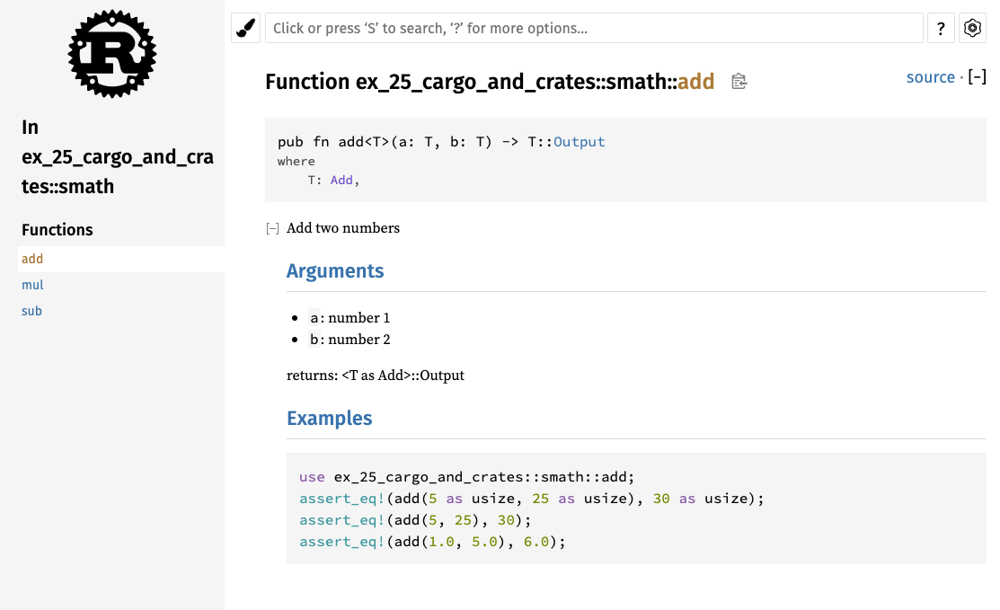

# Publishing a Crate to Crates.io

- [Book reference](https://doc.rust-lang.org/book/ch14-02-publishing-to-crates-io.html)

## Commands

```shell
# run the doc tests
cargo test

# create and open the doc
cargo doc --open
```

### Generated documentation




